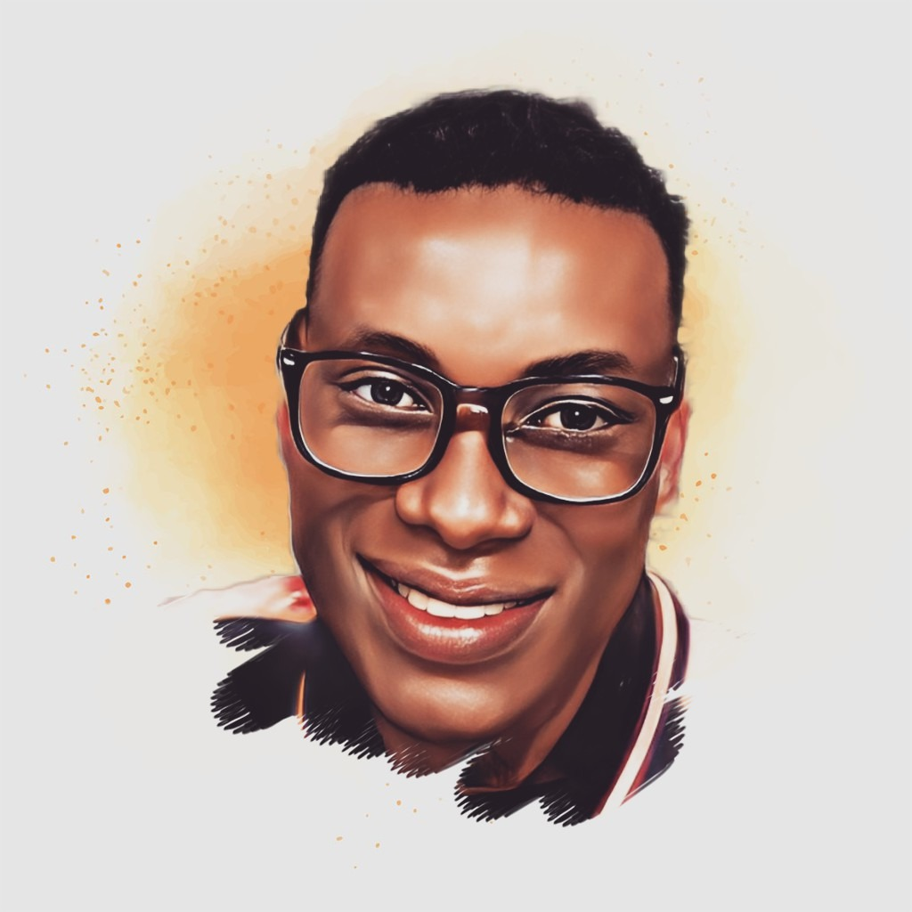

# 👋 Hello there, I’m `Ifeanyi Christwin Jr`

I am a Machine Learning Engineer specialized in Business Analytics and Intelligence Management. I also have professional interest in subjects of Thermodynamics and Informatics.

I advocate the adoption of soft energy paths, access economies, and veganism for the environment.

## Occupations
- Founder & Captain at [Switch Electric Ltd](https://whynotswitch.com)
- Founder at the [M3tering Protocol](https://discord.gg/Z4AyRjh7gW)
- Co-founder at Techniverse.org
- Co-founder at e-volt network

## Interests
- Web 3.0
- Startups
- Solar micro-grids
- Internet of Things
- Open Source community
- Renewable & Clean energies
- Machine Learning & Big Data

> Connect with me online [@iChristwin](https://linktr.ee/iChristwin)

.png)

